#  SIRHA – FrontEnd

##  a. Tecnologías utilizadas

* **React.js** (creación de interfaces y componentes).
* **Node.js + npm** (gestor de dependencias y ejecución).
* **Axios / Fetch API** (consumo de servicios backend).
* **React Router DOM** (navegación entre pantallas).
* **Bootstrap / TailwindCSS** (estilos y diseño responsivo).
* **Jest + React Testing Library** (pruebas funcionales y unitarias).
* **CI/CD con GitHub Actions + Azure** (integración y despliegue continuo).

---

##  b. Descripción general del sistema y cómo ejecutarlo

Este FrontEnd corresponde al sistema **SIRHA**, una plataforma diseñada para Facilitar la gestión de solicitudes de cambio de materia y grupo por parte de los estudiantes, con trazabilidad, priorización y control de capacidad, brindando a profesores y decanaturas las herramientas necesarias para evaluar y aprobardichas solicitudes.

###  Cómo ejecutarlo localmente:

1. Clonar el repositorio:

   ```bash
   git clone https://github.com/usuario/SIRHA-FrontEnd-DOSW.git
   cd SIRHA-FrontEnd-DOSW
   ```
2. Instalar dependencias:

   ```bash
   npm install
   ```
3. Levantar el servidor local:

   ```bash
   npm start
   ```

   Se ejecuta en: [http://localhost:3000](http://localhost:3000)

---

##  c. Diagrama de navegación del aplicativo

```mermaid
graph TD;
    Login[Login] --> Dashboard[Dashboard Principal];
    Dashboard --> GestionUsuarios[Gestión de Usuarios];
    Dashboard --> Reportes[Reportes];
    Dashboard --> Configuracion[Configuración];
    GestionUsuarios --> DetalleUsuario[Detalle Usuario];
    Reportes --> ReporteIndividual[Reporte Detallado];
```



 Explicación: el usuario inicia en **Login**, pasa al **Dashboard**, y desde allí navega a las diferentes secciones.

---

##  d. Cómo funciona el aplicativo

* El usuario inicia sesión con sus credenciales.
* El sistema valida la autenticación contra el Backend.
* Una vez dentro, puede acceder a diferentes módulos (usuarios, reportes, configuración).
* Cada acción se comunica con el **BackEnd vía API REST** y devuelve datos en tiempo real.

---

##  e. Funcionalidades y pantallas

### Funcionalidades principales:

1. **Login:** acceso seguro de usuarios.

   * Happy Path: usuario correcto → Dashboard.
   * Errores: credenciales inválidas → mensaje de error.
2. **Gestión de Usuarios:** crear, listar, actualizar y eliminar usuarios.

   * Happy Path: usuario creado correctamente.
   * Errores: campos vacíos → validación en pantalla.
3. **Reportes:** generación de reportes dinámicos.

   * Happy Path: reporte generado.
   * Errores: conexión fallida → mensaje de error.

 Cada pantalla está organizada en la carpeta `src/pages/` y los componentes en `src/components/`.

---

## f. Video/Link del Demo por funcionalidad

* **Login**: \[YouTube / Azure link aquí]
* **Gestión Usuarios**: \[YouTube / Azure link aquí]
* **Reportes**: \[YouTube / Azure link aquí]

---

## g. Diagrama de Componentes del Aplicativo a Gran Escala


---

## h. Evidencia de pruebas funcionales

Capturas de ejecución de pruebas con Jest / React Testing Library.
Ejemplo:

```bash
npm test
```


---

## i. Organización del código

```
SIRHA-FrontEnd-DOSW/
│── src/
│   ├── components/   # Componentes reutilizables
│   ├── pages/        # Vistas principales
│   ├── services/     # Conexión API
│   ├── tests/        # Pruebas unitarias
│   ├── App.js        # Componente principal
│   └── index.js      # Punto de entrada
```

---

##  j. Código Documentado

Ejemplo en un componente:

```jsx
/**
 * Componente Login
 * Permite al usuario ingresar al sistema con usuario y contraseña
 */
function Login() {
   // Estado local para manejar credenciales
   const [user, setUser] = useState("");
   const [password, setPassword] = useState("");

   return (...)
}
```

---

##  k. Evidencia del despliegue CI/CD en Azure

* Pipeline de **Desarrollo** → cada push a `develop` genera un build automático.
* Pipeline de **Producción** → cada merge a `main` despliega en Azure.

🔗 Link de despliegue en Azure: [https://sirha-frontend.azurewebsites.net](https://sirha-frontend.azurewebsites.net)

---

##  l. Pipelines (YAML simplificado)

###  Desarrollo

```yaml
on:
  push:
    branches: [ "develop" ]
jobs:
  build:
    runs-on: ubuntu-latest
    steps:
      - uses: actions/checkout@v2
      - run: npm install
      - run: npm run build
```

###  Producción

```yaml
on:
  push:
    branches: [ "main" ]
jobs:
  deploy:
    runs-on: ubuntu-latest
    steps:
      - uses: actions/checkout@v2
      - run: npm install
      - run: npm run build
      - name: Deploy to Azure
        uses: azure/webapps-deploy@v2
        with:
          app-name: "sirha-frontend"
```

## Prototipo de bajo nivel
Pantallas iniciales en baja fidelidad:
- Pantalla Login: Acceso de estudiantes, profesores y administradores al sistema.
  
  
- Dashboard: Diferenciado según rol, permite acceso a funcionalidades principales.
  
  
- Gestión de Horarios: Consulta y solicitud de reasignación de horarios.
  
  
- Notificaciones: Visualización de mensajes del sistema sobre solicitudes realizadas.
  
  
- Confirmación: Ventana modal para aceptar o cancelar una reasignación.
  
  


---

##  Estrategia de Versionamiento y Branches

###  Versionamiento

* Se usará **Semantic Versioning (SemVer)**:

  * **MAJOR**: cambios incompatibles con versiones anteriores.
  * **MINOR**: nuevas funcionalidades compatibles.
  * **PATCH**: correcciones de bugs y ajustes menores.

Ejemplo: `v1.2.3`

* `1` → versión mayor.
* `2` → nuevas funcionalidades.
* `3` → correcciones menores.

---

### Branches (Git Flow Simplificado)

* **`main`** → contiene el código estable en producción.
* **`develop`** → rama de integración, donde se unen todas las funcionalidades antes de pasar a producción.
* **`feature/<nombre>`** → ramas para nuevas funcionalidades. Se crean desde `develop` y se fusionan de nuevo en `develop`.
* **`release/<versión>`** → rama para preparar entregas, pruebas finales y documentación antes de pasar a `main`.
* **`hotfix/<nombre>`** → rama para correcciones críticas que deben aplicarse directamente a `main` y luego integrarse en `develop`.

Link Documento de Arquitectura Front: https://azure.microsoft.com/es-es/products/devops/?nav=min

Link Mock figma: https://www.figma.com/design/TKNUp84l1RozukfoyXDn3s/SHIRA?node-id=0-1&t=bobieBeKtkaggFiV-1 


